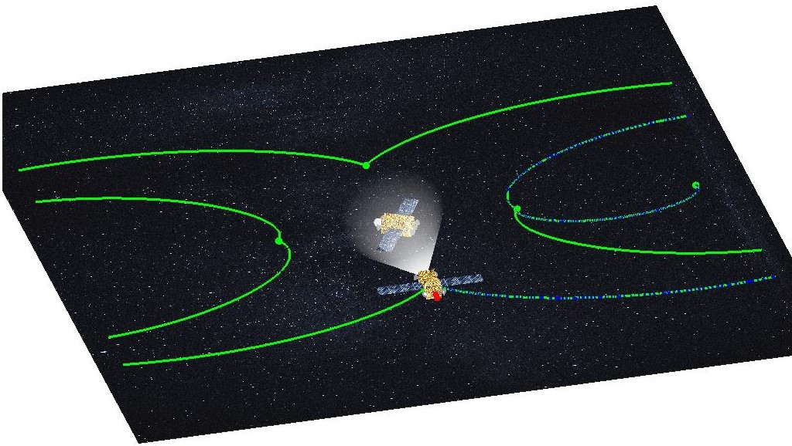

# Spacecraft video

This repository gathers MATLAB codes to generate spacecraft videos illustrating the resilient orbital inspection mission of the [Spacecraft-Resilience](https://github.com/Jean-BaptisteBouvier/Spacecraft-Resilience) project.
The video is available on [Youtube](https://youtu.be/DQy8iNHyt7M).

## Prerequisite

The chaser satellite follows the tracking trajectory saved in the data folder. These trajectories must be computed ahead of time with the `main` file of the [Spacecraft-Resilience](https://github.com/Jean-BaptisteBouvier/Spacecraft-Resilience) project.

## File structure

- Folder `data` contains the reference trajectory and the tracking trajectories to be followed by the chaser satellite.
- Folder `frames` contains a short gif of the generated video along with a few frames taken out of the generated videos to better illustrate them.
- Folder `functions` contains all the functions called by the main script to setup the satellite parameters, the plotting parameters, adjust the thrust and the camera flash.
- Folder `pictures` contains the pictures used for the texture of the satellites, their solar panels and the space background.
- File `main` generates the video of the chaser spacecraft orbiting around the target satellite and taking pictures at each waypoint despite a malfunctioning thruster.

## Results

At the first waypoint, the chaser satellite takes a picture of the target satellite for inspection.

The reference trajectory is shown in green, while the actual trajectory of the malfunctioning spacecraft is shown in blue and is maintained very close to the reference. The malfunctioning thruster is shown in red and produces a red plume while the four controlled thrusters are shown in grey and produce a blue plume.

After reaching the second waypoint, the chaser satellite takes another picture of the target satellite for inspection.

An accelerated version of the video in gif format

## Contributors

[Jean-Baptiste Bouvier](https://jean-baptistebouvier.github.io/)
